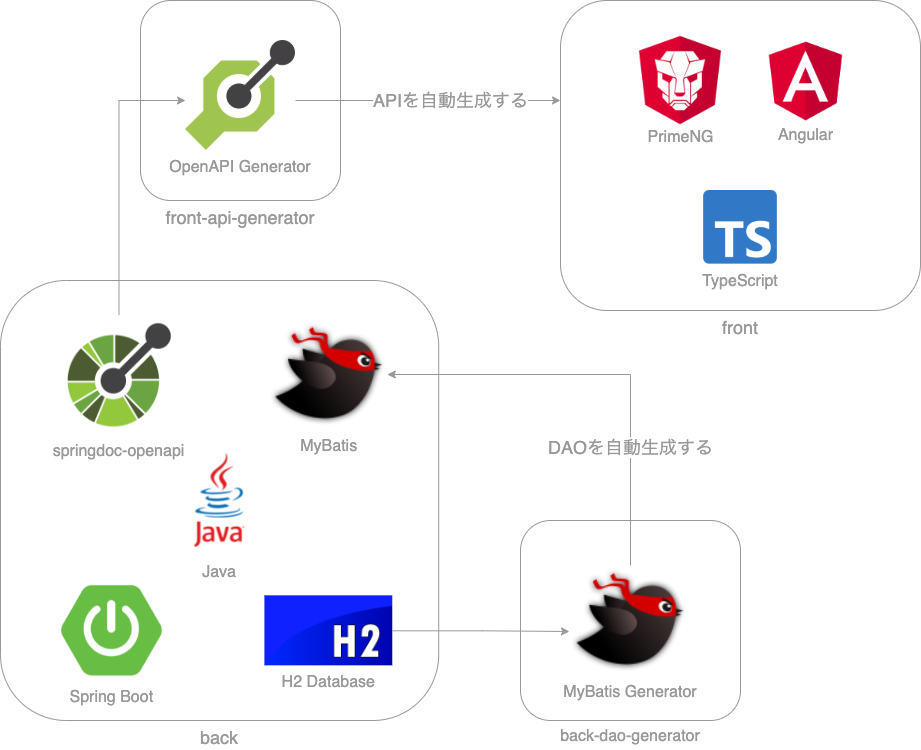

# Andres

技術検証のための、Webアプリケーションです。

5日間で開発しました。

## デモ

https://y-chip.github.io/andres/#/

GitHub PagesとHerokuでホスティングしています。

Herokuは無料プランを使っているため、初回の画面表示には時間がかかることがあります。

## アーキテクチャ

## アーキテクチャの構成要素

### front

シングルページアプリケーションのクライアントです。

| 構成要素       | 説明                                                                          |
|------------|-----------------------------------------------------------------------------|
| TypeScript | Microsoftが開発した、プログラミング言語です。 JavaScriptに「静的型付け」と「クラスベースのオブジェクト指向」をもたらします。 |
| Angular    | Googleが開発した、フレームワークです。 フルスタックであり、フロントエンドに必要な機能が揃っています。                   |
| PrimeNG    | トルコのPrimeTek Informaticsが開発した、UIコンポーネントライブラリです。 高機能なUIコンポーネントが揃っています。    |

### back

WebAPIを提供するサーバーです。

| 構成要素                    | 説明                                                                              |
|-------------------------|---------------------------------------------------------------------------------|
| Java                    | 「静的型付け」で「クラスベースのオブジェクト指向」のプログラミング言語です。                                          |
| Spring&#160;Boot        | 支持率の高い、フレームワークです。                                                               |
| H2&#160;Database        | 軽量なデータベースです。 手軽に利用するために、サーバーに組み込んでいます。                                       |
| MyBatis                 | データベースを操作する、フレームワークです。 後述する、MyBatis Generatorで自動生成しています。                     |
| springdoc&#8209;openapi | Spring Bootをもとに、OpenAPIを自動生成するライブラリです。 後述する、OpenAPI Generatorのために、自動生成しています。 |

### back-dao-generator

データベースを操作するための、プログラムを自動生成します。

| 構成要素                   | 説明                          |
|------------------------|-----------------------------|
| MyBatis&#160;Generator | MyBatisのプログラムを、自動生成するツールです。 |

### front-api-generator

WebAPIを呼び出すための、プログラムを自動生成します。

| 構成要素                   | 説明                                                                   |
|------------------------|----------------------------------------------------------------------|
| OpenAPI&#160;Generator | WebAPIを呼び出すプログラムを、自動生成するツールです。 さまざまなプログラム言語／フレームワークにむけて、自動生成できます。 |

## 特徴

### プログラムの自動生成

- データベースを操作するためのプログラム
- WebAPIを呼び出すためのプログラム

を自動生成しています。

自動生成することで、開発効率を向上したり、不具合を防ぐことができます。

### ビルドツールでの管理

ビルドツールで管理することで、ワンコマンドで、つぎの操作ができるようになってます。

- ビルド
- デプロイ
- フォーマッターの適用
- プログラムの自動生成

CIと組み合わせることで、さまざまな自動化ができます。

### コンポーネント指向の設計

コンポーネント指向の設計により、簡潔な実装になっています。

### 通信処理

WebAPIを呼び出したときに、自動的に、つぎの動作をするようになっています。

- オーバーレイを表示して、二重送信を防止する。
- 入力エラーがあれば、メッセージを表示して、該当箇所までスクロールする。
- 予期せぬエラーがあれば、メッセージを表示して、ログを出力する。
